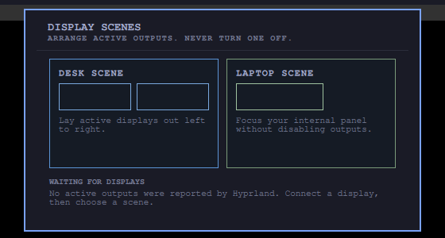

# Desk Transition


[](https://ko-fi.com/U5S225PTME)

Desk Transition gives Hyprland two local display actions: **Desk** lays every
active output out left to right, while **Laptop** focuses the first active eDP
or LVDS panel. It never hard-codes output names or disables a display.



The committed preview is a direct 1280 by 720 capture from the isolated Buzz
Omarchy rig. The unchanged plugin scanned a deterministic two-output Hyprland
fixture, applied both scenes through live shell IPC, proved that no disable
command was emitted, and opened the populated panel. `.render-proof.json`
binds the exact source package, runtime log, action log, fixture, screenshot,
and human visual approval.

Every action reads a fresh monitor list and validates the selected name before
dispatching a Hyprland command. With no Hyprland session it reports an empty
state rather than guessing at hardware.

## Install

```bash
omarchy plugin add https://github.com/jeremylongshore/omarchy-desk-transition-entry --enable
```

Use Desk to arrange active outputs, Laptop to refocus the internal panel, or
select a detected monitor directly.

## Verify

```bash
npm test
npm run test:race
npm run test:mutation
npm run audit
npm audit --audit-level=low
shellcheck --severity=warning scripts/*.sh e2e/*.sh .githooks/pre-push
bash scripts/run-plugin-gates.sh
bash scripts/check-lane-freshness.sh
npm run test:e2e
```

After inspecting the exact new preview at marketplace scale, bind approval with
`scripts/approve-preview.sh`. C43 blocks submission when copy is not exactly
500 characters, the banner is unsafe or missing, the Buzz receipt is stale, or
the preview hash has not received explicit visual approval.

## Maintainers wanted

These plugins are growing, and we are looking for dependable Omarchy users who
want to review issues, test releases, and keep a plugin healthy over time. Start
with a small pull request or [open a maintainer interest issue](../../issues/new?template=maintainer_interest.md&title=Maintainer%20interest%3A%20)
titled **Maintainer interest**. Tell us which plugin you use and how you want to
help. Consistent contributors can earn maintainer responsibility.

## License

MIT
