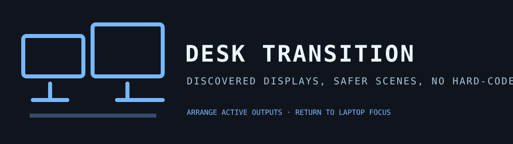

# Desk Transition



[](https://ko-fi.com/U5S225PTME)

Desk Transition inspects the current local Hyprland monitor inventory and offers
a Desk arrangement for already active outputs plus a Laptop scene that returns
focus to an internal eDP or LVDS panel. It does not hard-code output names or
disable a display.

Every action reads a fresh monitor list and validates the selected name before
dispatching a Hyprland command. With no Hyprland session it reports an empty
state rather than guessing at hardware.

## Install

```bash
omarchy plugin add https://github.com/jeremylongshore/omarchy-desk-transition-entry --enable
```

Use Desk to arrange active outputs, Laptop to refocus the internal panel, or
select a detected monitor directly.

## Verify

```bash
npm test
bash scripts/run-plugin-gates.sh
bash scripts/check-lane-freshness.sh
bash scripts/rig-verify.sh .
bash scripts/rig-render.sh . preview.png
```

## License

MIT
